# SLICE: Skeleton-Length IoU for Crack Evaluation

SLICE scores a road crack segmentation by **centreline length**: the matched, missed and spurious length
of the crack, in pixels. Pavement surveys measure linear cracks by length (for example ASTM D6433), and SLICE
follows that measure. It depends little on how wide the masks are drawn, it drops with missed and spurious length,
and it needs no tolerance radius. **SLICE measures length, not area, so it should be reported with IoU.**

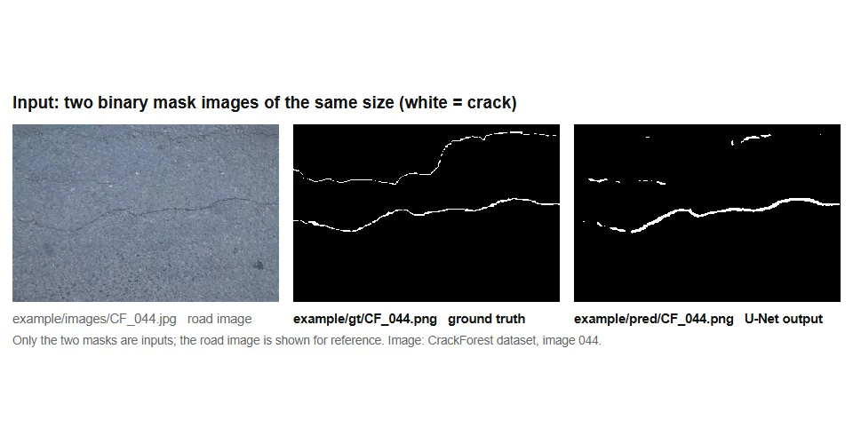

*CrackForest image 044: the two input masks, the matched centreline, the score, the printed output,
then mask width (SLICE stays, IoU falls), missed length and spurious length (SLICE falls).*

Results in the paper (30 road images, three public datasets):

- Mask width 1 to 17 px: SLICE 0.97 to 1.00 (CV 1.0%).
- 50% of the prediction missed or spurious: SLICE 0.44 and 0.30.
- Five annotators drawing the ground truth: score CV 3.1% (IoU 19.2%).
- Complete thick versus incomplete thin mask (T1 pairs): 99.3% agreement with five raters.

Everything is in one file, `slice_metric.py`. The `example/` folder has 10 real road images with their
ground truth, a U-Net prediction, and the output the code writes for them. Every number and picture below
comes from these files.

## 1. Input

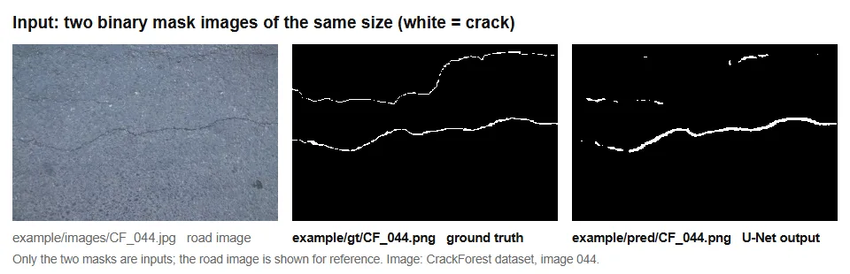

Two mask images of the **same size**:

- the **ground truth (GT)**, the crack drawn by a person;
- the **prediction**, the model output **already thresholded** to crack and background.

White (or any colour) is crack and black is background. PNG, BMP or TIFF files work, with 0/255 or 0/1 values.
JPEG blurs the edges and is best avoided. The road image itself is not an input.

The example folder:

```
example/
  images/   CF_004.jpg ... CF_113.jpg    10 road images (for reference only)
  gt/       CF_004.png ... CF_113.png    ground truth masks
  pred/     CF_004.png ... CF_113.png    U-Net predictions, same file names
  output/   slice_results.csv, CF_004_slice.png ...   files written by the code (section 3)
```

## 2. Run

```
git clone https://github.com/Ronald-Kray/slice-metric.git
cd slice-metric
pip install -r requirements.txt          # numpy and scikit-image, Python 3.9 or later
```

**One image pair:**

```
python slice_metric.py example/gt/CF_044.png example/pred/CF_044.png
```

**A whole folder** (GT and prediction files with the same names), saving a table and one picture per image:

```
python slice_metric.py example/gt example/pred --out results
```

**In Python:**

```python
from slice_metric import slice_metric, slice_pooled

r = slice_metric("example/gt/CF_044.png", "example/pred/CF_044.png")   # file paths or binary NumPy arrays
print(r.SLICE, r.a1, r.a2, r.a3)                                         # 0.4903... 506 459 67

names = ["CF_004", "CF_020", "CF_044"]
pooled = slice_pooled([(f"example/gt/{n}.png", f"example/pred/{n}.png") for n in names])
print(pooled.SLICE)
```

To use it in another project, copying `slice_metric.py` next to your script is enough.

## 3. Output

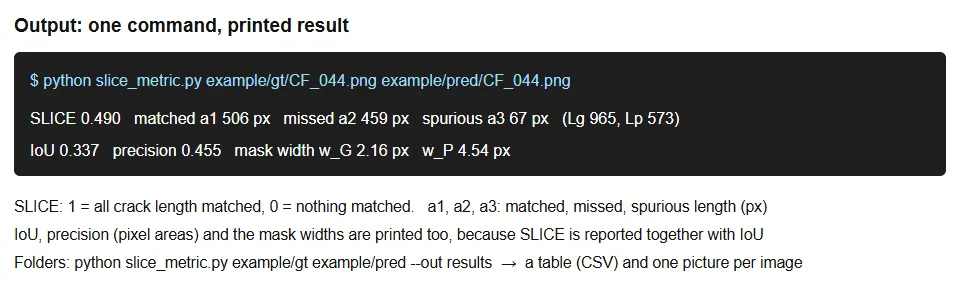

One image pair:

```
SLICE 0.490   matched a1 506 px   missed a2 459 px   spurious a3 67 px   (Lg 965, Lp 573)
```

A folder, one line per image and the pooled result:

```
image                           SLICE     a1     a2     a3
CF_004.png                      0.862    523     36     48
CF_020.png                      0.806    466    112      0
CF_040.png                      0.532    442    327     62
CF_044.png                      0.490    506    459     67
CF_060.png                      0.709    501    206      0
CF_061.png                      0.909    571     51      6
CF_062.png                      0.944    503     25      5
CF_088.png                      0.925    516     32     10
CF_106.png                      0.654    420    206     16
CF_113.png                      0.739    413    146      0

10 images   pooled SLICE 0.728   per-image mean 0.757
missed a2/Lg 0.248   spurious a3/Lg 0.033
saved results/slice_results.csv and 10 picture(s) in results
```

| Output | Meaning |
|---|---|
| `SLICE` | 1 = all centreline length matched, 0 = nothing matched |
| `a1` | matched length (px): centreline of the overlap of GT and prediction |
| `a2` | missed length (px): `Lg − a1` |
| `a3` | spurious length (px): `Lp − a1` |
| `Lg`, `Lp` | centreline length of the GT and of the prediction |
| pooled SLICE | Σa1 / (Σa1 + Σa2 + Σa3) over all images, the value to report for a dataset |

With `--out`, the code also writes `slice_results.csv` (the same numbers and a `POOLED` row) and one picture per image:
**green** is the matched centreline (a1), **orange** the GT centreline outside the prediction (missed),
**magenta** the predicted centreline outside the GT (spurious); light orange and light blue are the GT and predicted areas.
The pictures in `example/output/`:

| Road image | Picture written by `--out` | SLICE |
|---|---|---|
| 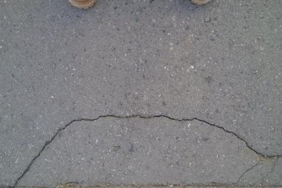 | 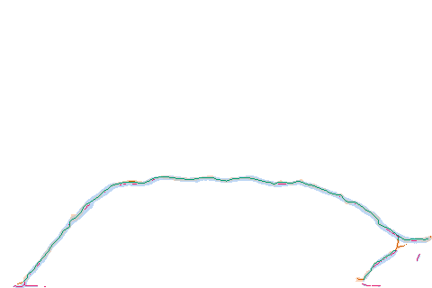 | 0.862 |
| 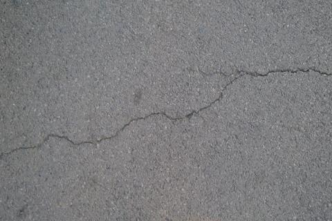 | 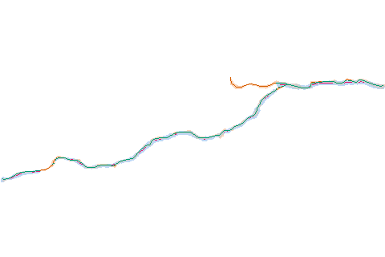 | 0.806 |
| 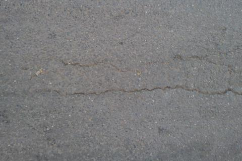 | 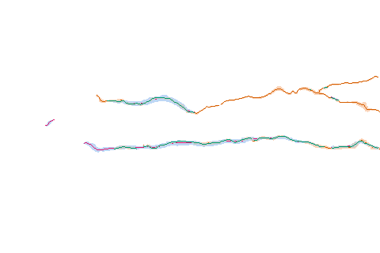 | 0.532 |
| 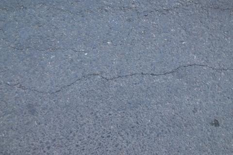 | 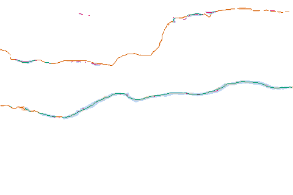 | 0.490 |
| 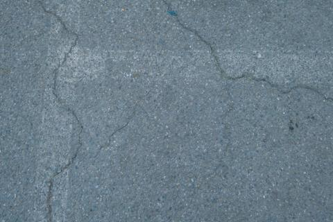 | 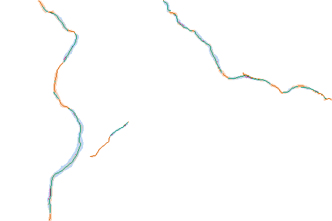 | 0.709 |
| 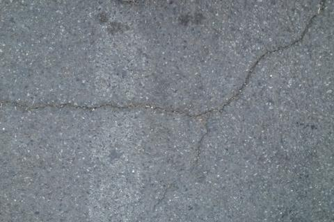 | 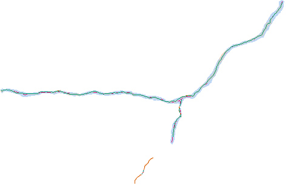 | 0.909 |
| 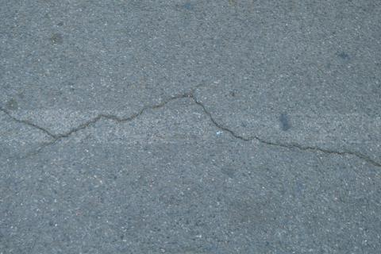 | 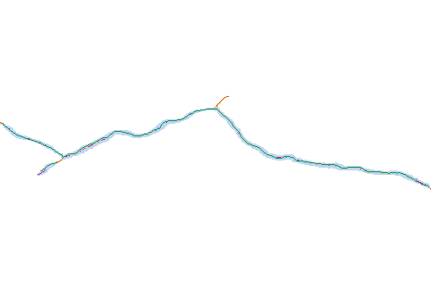 | 0.944 |
| 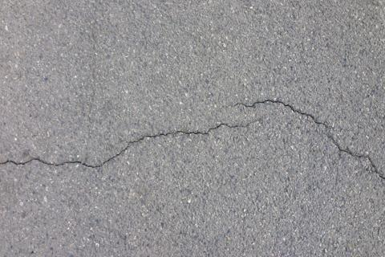 | 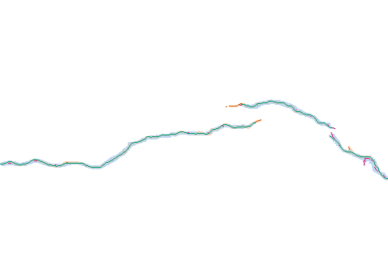 | 0.925 |
| 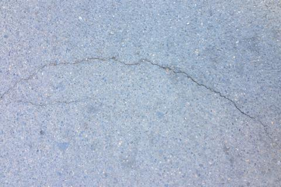 | 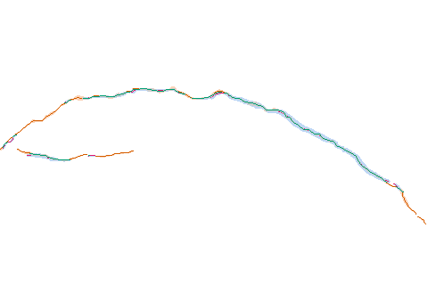 | 0.654 |
| 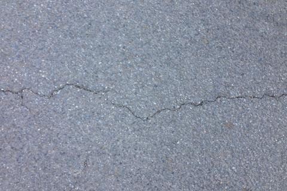 | 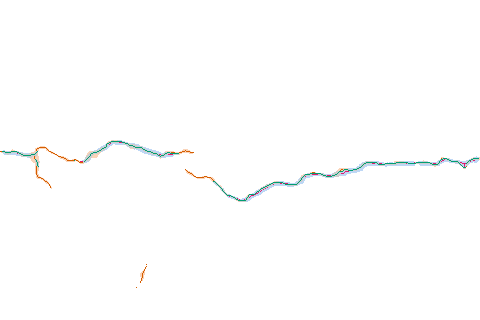 | 0.739 |

A GT image without a prediction file is scored as an empty prediction, so all its length counts as missed.
SLICE is 0 if either mask is empty.

## 4. Computing SLICE: a1, a2, a3

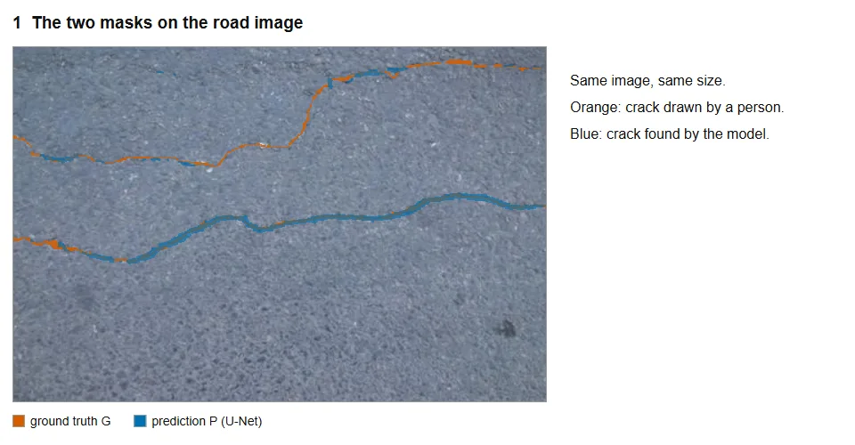

The steps of the paper (Section 2.4), shown above on CF_044:

1. **Masks.** GT `G` and prediction `P` of the same size, `P` thresholded at one fixed value.
2. **Centreline lengths.** Thin `G`, `P` and their overlap `G ∩ P` to 1-pixel centrelines (Zhang-Suen)
   and count the pixels: `Lg`, `Lp` and `s`.
3. **Matched, missed, spurious.** `a1 = min(s, Lg, Lp)` (green), `a2 = Lg − a1` (orange), `a3 = Lp − a1` (magenta),
   and `SLICE = a1 / (a1 + a2 + a3)`. For CF_044: 506 / (506 + 459 + 67) = 0.49.
   The overlap of the two masks decides which centreline counts as matched, so no tolerance radius is needed.
4. **Dataset.** Sum a1, a2 and a3 over the images before taking the ratio (pooled SLICE).

## 5. Mask width and detection errors

**Mask width.** The GT centreline of CF_044 redrawn 1 to 17 px wide keeps SLICE at 0.99 to 1.00,
while IoU peaks at 0.63 (3 px) and falls to 0.12 (17 px) (Experiment 1a of the paper, on one image).

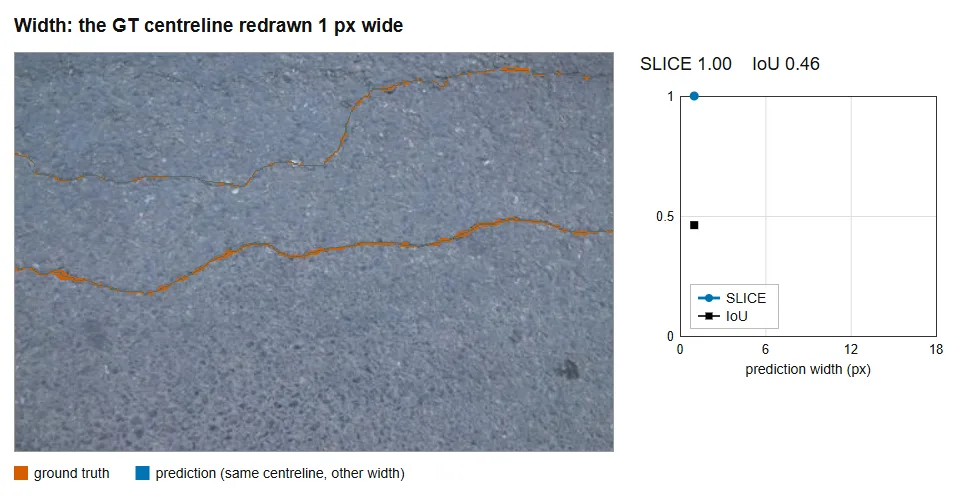

**Missed and spurious length.** Gaps cut out of the U-Net prediction (missed length) and stray fragments
added to it (spurious length) both lower SLICE (Experiment 1b of the paper, on one image).

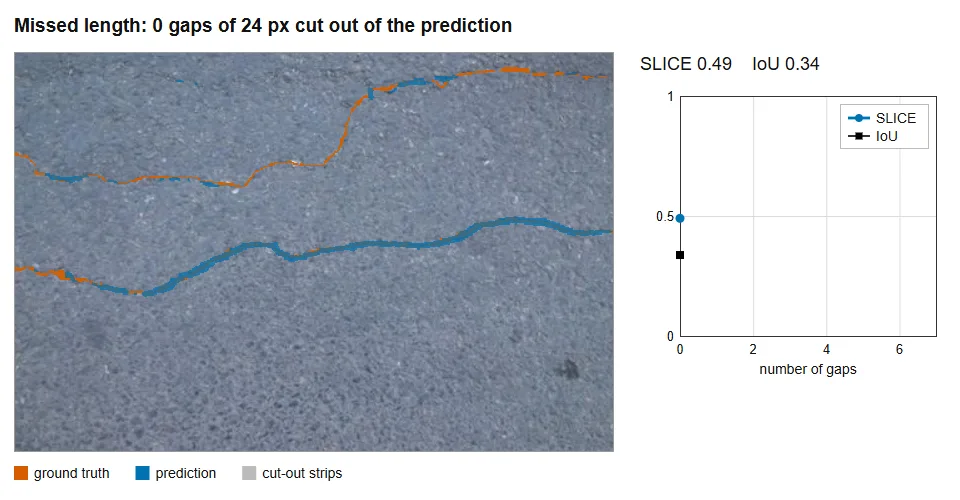

## Preparing the masks

- The prediction has the same size as the GT. Resize it first and note the interpolation.
- Every prediction is thresholded at **one fixed value** (0.5 on probabilities unless stated), not per image.
- No hole filling, removal of small parts or cropping. These steps change the lengths.

## Reporting SLICE

SLICE measures length, not area, so it should be reported with IoU. Following Table 4 of the paper:

- the **pooled** SLICE as the headline value, with the per-image mean next to it, for each GT source separately;
- `a2/Lg` and `a3/Lg`, the missed and spurious shares of the GT length;
- IoU and precision;
- the mean mask widths `w_G` and `w_P` (mask area divided by centreline length, pooled over the images);
- the threshold, the resize interpolation, the scikit-image version, the image size and the pixel size.

## Limitations

- **Thick or blob-shaped predictions** can raise SLICE, because extra area adds little centreline length.
  A SLICE gain that comes with a lower IoU and a higher `w_P/w_G` is not counted as an improvement.
- **Implicit tolerance.** Centreline offsets smaller than about `(w_G + w_P)/2` count as matched.
  IoU or HD95 shows the position error.
- **One GT set at a time.** The implicit tolerance follows the GT width, so scores against GT sets drawn
  to different conventions are not directly comparable.
- **Crack-free images.** Two empty masks give a per-image SLICE of 0; use the pooled value and `a3`.
- Tested on linear (longitudinal and transverse) cracks with predictions up to 17 px wide.
  Area-type damage, crack width and severity were not tested.

## Tests

The tests reproduce the test cases (Table 2) and the worked example (Fig. 1b) of the paper,
and the results in `example/output/`. Other thinning implementations can give other lengths,
so run them once, especially with another scikit-image version:

```
pip install pytest
python -m pytest -q
```

The paper values were computed with scikit-image 0.26 (Python 3.11, NumPy 2.4).

## Definition

```
Lg = |skel(G)|,  Lp = |skel(P)|,  s = |skel(G ∩ P)|
a1 = min(s, Lg, Lp),  a2 = Lg − a1,  a3 = Lp − a1
SLICE = a1 / (a1 + a2 + a3) = a1 / (Lg + Lp − a1)
pooled SLICE = Σa1 / (ΣLg + ΣLp − Σa1)
```

`skel` is Zhang-Suen thinning without pruning (`skimage.morphology.skeletonize(mask, method="zhang")`),
and a length is a count of skeleton pixels.

## Data and citation

The road images and ground truth masks in `example/` are from the CrackForest dataset:
Y. Shi, L. Cui, Z. Qi, F. Meng, Z. Chen, Automatic road crack detection using random structured forests,
IEEE Transactions on Intelligent Transportation Systems 17(12) (2016) 3434–3445.
The predictions are from the U-Net used in the paper.

Citation for SLICE:
H. Ann, H. Park, J.-J. Lee, SLICE (Skeleton-Length IoU for Crack Evaluation): a centreline-length metric
with low mask-width dependence for road crack segmentation, in preparation.

The other data of the paper (annotator masks, rater responses) are shared on request.

## License

MIT for the code (see `LICENSE`). The example images keep the terms of the CrackForest dataset.
