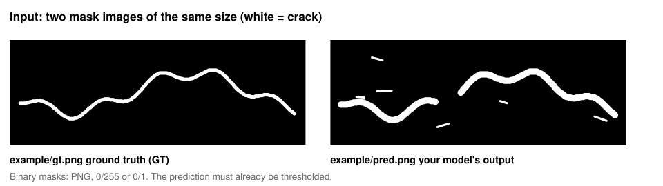
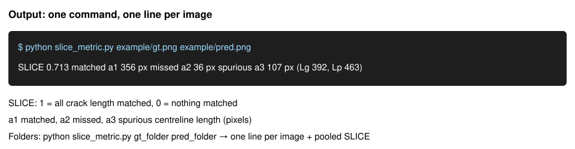

# SLICE: Skeleton-Length IoU for Crack Evaluation

SLICE scores a crack segmentation by **how much crack length it gets right**, not by how many pixels overlap.
Road surveys measure cracks by length (for example ASTM D6433), so a crack metric that follows length
is easier to relate to a survey. SLICE hardly changes when a mask is drawn thinner or thicker,
it drops when crack length is missed or when stray length is added, and it needs no tolerance radius.



*The whole idea in six scenes: two input masks, the matched centreline, the score, the printed output,
then width (SLICE stays, IoU falls) and stray fragments (SLICE falls).*

Everything is in one file, `slice_metric.py`. The figures below use the example masks in `example/`,
and every number in them is computed with that file.

## 1. Input



Two mask images of the **same size**:

- `gt.png`: the ground truth (GT), a crack drawn by a person.
- `pred.png`: your model's output, **already thresholded** to crack / background.

White (or any colour) is crack and black is background. Save them as PNG, BMP or TIFF.
A 0/255 or a 0/1 image both work. Avoid JPEG, which blurs the edges.

Try it with `example/gt.png` and `example/pred.png` in this repository.

## 2. Run

```
git clone https://github.com/Ronald-Kray/slice-metric.git
cd slice-metric
pip install -r requirements.txt          # numpy and scikit-image, Python 3.9 or later

python slice_metric.py example/gt.png example/pred.png
```

Or download `slice_metric.py` alone and put it next to your own script.

**A whole dataset:** put the GT masks in one folder and the predictions in another, with the same file names.

```
python slice_metric.py gt_folder pred_folder
```

**In Python:**

```python
from slice_metric import slice_metric, slice_pooled

r = slice_metric("example/gt.png", "example/pred.png")    # file paths or binary NumPy arrays
print(r.SLICE, r.a1, r.a2, r.a3)                           # 0.713... 356 36 107

pooled = slice_pooled([("gt1.png", "pred1.png"), ("gt2.png", "pred2.png")])
print(pooled.SLICE)
```

## 3. Output



For one image pair:

```
SLICE 0.713   matched a1 356 px   missed a2 36 px   spurious a3 107 px   (Lg 392, Lp 463)
```

For two folders, one line per image, then the dataset result:

```
image                           SLICE     a1     a2     a3
a.png                           0.713    356     36    107
b.png                           0.000      0    392      0  (no prediction file: scored as empty)

2 images   pooled SLICE 0.400   per-image mean 0.357
missed a2/Lg 0.546   spurious a3/Lg 0.136
```

| Output | Meaning |
|---|---|
| `SLICE` | 1 = all crack length matched, 0 = nothing matched |
| `a1` | Matched length (pixels): centreline of the area where GT and prediction overlap |
| `a2` | Missed length: GT crack that the prediction did not cover |
| `a3` | Spurious length: predicted crack that is not in the GT |
| `Lg`, `Lp` | Centreline length of the GT and of the prediction |
| pooled SLICE | Σa1 / (Σa1 + Σa2 + Σa3) over all images: the value to report for a dataset |

A GT image without a prediction file is scored as an empty prediction, so all its length counts as missed.
SLICE is 0 if either mask is empty.

## 4. How SLICE is computed



1. Put the two masks on top of each other.
2. Thin each mask to a 1-pixel centreline and count its pixels: `Lg` for the GT, `Lp` for the prediction.
3. Take the overlap of the two masks first, then thin it: its length is the matched length `a1`.
   The mask widths decide where the two masks meet, so no tolerance radius is needed.
4. Missed `a2 = Lg − a1`, spurious `a3 = Lp − a1`, and `SLICE = a1 / (a1 + a2 + a3)`.

## 5. What changes SLICE, and what does not

**Mask width hardly changes it.** The same crack drawn 1 to 17 px wide keeps SLICE near 1, while IoU falls.



**Errors lower it.** Stray fragments add little area but real length, so SLICE drops more than IoU.
Gaps in the prediction count as missed length (step 4 above).



## Before you run

- The prediction must have the same size as the GT. Resize it first.
- Threshold every prediction at **one fixed value** (for example 0.5 on probabilities), not a different value per image.
- Do not fill holes, remove small parts or crop. These steps change the lengths.

## What to report

SLICE measures length, not area, so report it **with IoU**.

- For a dataset, report the **pooled** SLICE, with the per-image mean next to it.
- Report `a2/Lg` and `a3/Lg` (missed and spurious shares) to show which error dominates.
- Report IoU and precision, and the threshold you used.

## When SLICE can mislead

- **Very thick or blob-shaped predictions** can raise SLICE, because extra area adds little centreline length.
  If SLICE goes up while IoU goes down, check the prediction width before trusting the gain.
- **Small position shifts are forgiven.** Offsets smaller than about half the sum of the two mask widths still
  count as matched. Use IoU if exact position matters.
- **Compare within one GT set.** A GT drawn wider or thinner by another annotator changes this tolerance,
  so scores against different GT sets are not directly comparable.
- Tested on linear road cracks (longitudinal and transverse). Area-type damage, crack width and severity were not tested.

## Check your installation

The tests reproduce the test cases of the paper. Run them once, especially with another scikit-image version,
because other thinning implementations can give other lengths:

```
pip install pytest
python -m pytest -q
```

The paper values were computed with scikit-image 0.26 (Python 3.11, NumPy 2.4).

## Definition

```
Lg = |skel(G)|,  Lp = |skel(P)|,  s = |skel(G ∩ P)|
a1 = min(s, Lg, Lp),  a2 = Lg − a1,  a3 = Lp − a1
SLICE = a1 / (Lg + Lp − a1)
pooled SLICE = Σa1 / (ΣLg + ΣLp − Σa1)
```

`skel` is Zhang-Suen thinning without pruning (`skimage.morphology.skeletonize(mask, method="zhang")`),
and a length is a count of skeleton pixels.

## Citation

Ann, H., Park, H., Lee, J.-J. SLICE (Skeleton-Length IoU for Crack Evaluation): a centreline-length metric
with low mask-width dependence for road crack segmentation. In preparation.

The data of the paper (annotator masks, rater responses) are shared on request.

## License

MIT. See `LICENSE`.
